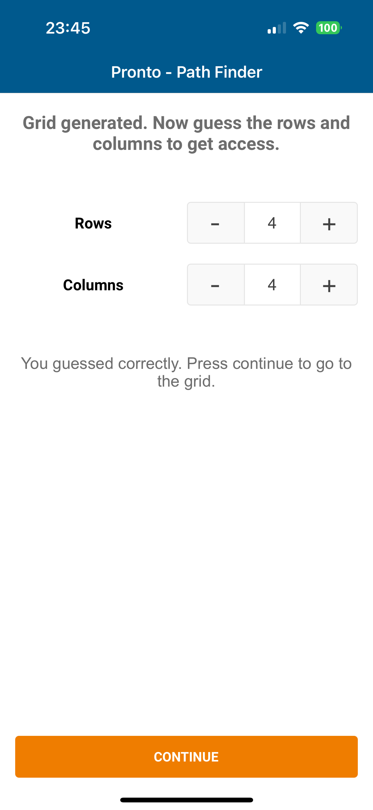
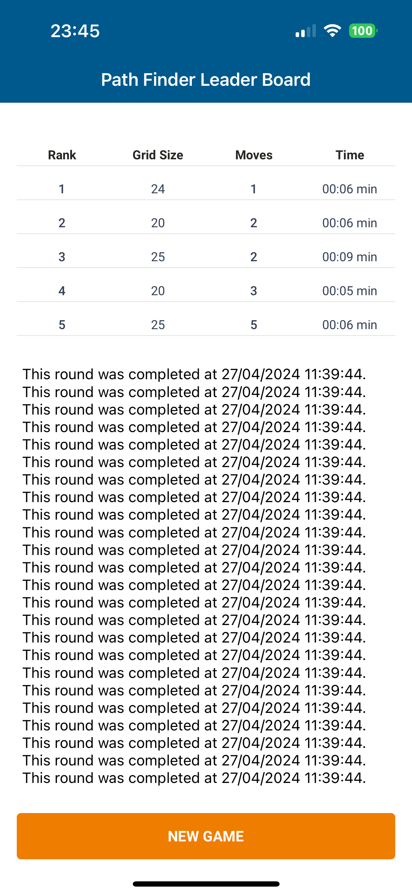

# Swift Path Finder Assignment

Welcome to the Swift Path Finder assignment! This project aims to create a simple grid-based navigational game using Swift. Below you will find instructions on how to set up and navigate through the app.

## Instructions

### Project Overview

This project follows the MVC architecture and utilizes the DataSource pattern for efficient data handling. It consists of three screens:

1. **First Screen**: Guess the dimensions of the grid.
2. **Second Screen**: Navigate a robot icon to a destination point on the grid.
3. **Leader Board Screen** (optional): View statistics of the last 5 completed rounds.

### First Screen

<p align="center">
  
</p>


- Tap on the "Generate Grid" button to generate two random numbers between 4 and 6, determining the number of rows and columns.
- Guess the number of rows and columns based on the total number of cells in the grid.
- Once guessed correctly, tap on the "Continue" button to proceed to the next screen.

### Second Screen

<p align="center">
  
</p>

- The grid with the correct number of rows and columns will be displayed.
- A robot-like icon is placed at cell (1,1), and a destination point (excluding (1,1)) is randomly selected.
- Navigate the robot icon to the destination point using the navigation buttons (North, East, South, West) or by tapping on adjacent cells.
- Animate the movement of the robot icon to the destination point.
- Save the game statistics including the number of moves, grid size, and time taken in the data store.

### Leader Board Screen

<p align="center">
  
</p>

- After completing a round, view the leader board with statistics of the last 5 completed rounds.
- Each round is ranked based on a custom logic defined as follows:

```swift
func rankGameHistory(history: [GameState]) -> [GameState] {
    var gameHistory = history
    gameHistory.sort(){$0.startTime > $1.startTime}
    var lastFive = Array(gameHistory.prefix(5))
    lastFive.sort(){$0.getRankValue() < $1.getRankValue()}
    return lastFive
}

func getRankValue(gameState: GameState) -> Double {
    let timeDiff = abs((gameState.endTime?.timeIntervalSince1970 ?? 0) - gameState.startTime.timeIntervalSince1970)
    return Double(gameState.stepCount) * timeDiff / Double(gameState.gridSize)
}
```

## Ranking Logic Explanation

The ranking logic in this Swift Path Finder assignment aims to evaluate the performance of each round and rank them from best to worst based on a combination of factors such as the number of moves made, the time taken, and the size of the grid.

Here's a breakdown of the ranking logic:

1. **Sorting by Start Time**: Initially, the game history array is sorted in descending order based on the start time of each round. This ensures that the most recent rounds appear first in the list.

```swift
gameHistory.sort() { $0.startTime > $1.startTime }
```

2. **Selecting Last Five Rounds**: From the sorted game history, the logic selects the last five completed rounds to consider for ranking. This ensures that only recent rounds are included in the ranking process.

```swift
var lastFive = Array(gameHistory.prefix(5))
```

3. **Ranking Calculation**: For each round in the last five rounds, a custom rank value is calculated using the following formula:

```swift
func getRankValue(gameState: GameState) -> Double {
    let timeDiff = abs((gameState.endTime?.timeIntervalSince1970 ?? 0) - gameState.startTime.timeIntervalSince1970)
    return Double(gameState.stepCount) * timeDiff / Double(gameState.gridSize)
}
```

- **Time Difference (timeDiff)**: Calculates the absolute time difference between the end time and start time of the round. This represents the duration of the round.
- **Step Count**: Represents the total number of moves made during the round.
- **Grid Size**: Indicates the size of the grid used in the round.

The rank value is calculated as the product of step count and time difference, divided by the grid size. This formula considers both efficiency (fewer moves and less time) and the complexity of the grid (larger grid size).

4. **Sorting by Rank Value**: Finally, the last five rounds are sorted based on their rank values in ascending order. Rounds with lower rank values (indicating better performance) will appear higher in the ranking.

```swift
lastFive.sort() { $0.getRankValue() < $1.getRankValue() }
```

Overall, this ranking logic provides a balanced assessment of each round's performance, taking into account the number of moves, time taken, and grid size. Rounds with fewer moves, shorter duration, and smaller grid sizes will be ranked higher, reflecting better performance.

## Demo

<p align="center">
  
  
</p>


[Demo Video](https://drive.google.com/file/d/1uGdqj55cCL0HAvRnWVKldYjtpHzxzpV-/view?usp=sharing)